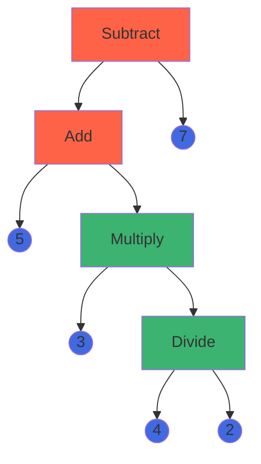

# eval-expression


An arithmetic expression evaluator built using .NET

## Prerequisites

- [.NET 8 SDK](https://dotnet.microsoft.com/en-us/download/dotnet/8.0)
- [Visual Studio](https://visualstudio.microsoft.com/vs/community/) or other IDE

## Getting started

- Clone this repo `git clone https://github.com/dariomrk/eval-expression.git`
- The source (`/src`) is comprised of four projects:
  - `Lexer`: converts the string expression representation into tokens
  - `Parser`: builds an abstract syntax tree
  - `Interpreter`: evaluates the tree
  - `Core`: wraps the evaluation pipeline with the `Evaluate(...)` method
- The code is tested with unit & integration tests (`/test`)
  - Run them with `dotnet test` or using the integrated test explorer of your IDE

## Usage sample

```csharp
// ...
var result = Core.Core.Evaluate("5+3*(4/2)-7");
Console.WriteLine(result); // will output 4
// ...
```
- Using a debugger you can observe the different steps of evaluating this expression.
- The parser should output an AST like this:
